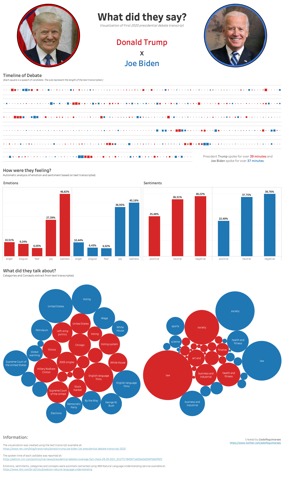

# Visualização da Transcrição do Debate entre Donald Trump e Joe Biden

A proposta da visualização foi exibir as informações extraídas da transcrição do primeiro debate dos presidenciáveis americanos. O encontro entre os candidatos aconteceu no dia 29/09/20 e foi promovido pela rede de TV americana CNN. A transcrição completa do debate pode ser encontrada [neste site](https://www.rev.com/blog/transcripts/donald-trump-joe-biden-1st-presidential-debate-transcript-2020). 

A idéia era destacar como os candidatos falaram ao longo do debate a partir da organização das falas (sequência e tempo de fala), dos sentimentos e emoções extraídos dos textos e, por último, dos tópicos que foram mais discutidos. 

Segue a visualização criada com os comentários sobre a mesma :) 

## Visualização

## Comentários

A visualização foi dividida em três partes: (1) Timeline, (2) Emoções e Sentimentos e (3) Tópicos discutidos. Para cada uma destas etapas usei visualizações distintas. 

### Timeline

Na **timeline** o objetivo era mostrar como se deu o debate em termos da fala de cada um. A idéia era visualizar a ordem das falas e quanto cada candidato falou. Como na transcrição não extrai o tempo de fala, usei o tamanho do texto como métrica para essa informação. Cada quadrado é uma fala e o tamanho é proporcional ao tamanho do texto. A informação do tempo de cada candidato não foi extraída a partir da transcrição, essa informação foi disponibilizada [neste link](https://edition.cnn.com/politics/live-news/presidential-debate-coverage-fact-check-09-29-20/h_9157f17840971e050e3d006f5b60f6f2).

Os textos foram organizados em ordem cronológica. Como eram muitas falas, a informação foi quebrada em várias linhas. Cada linha possui 100 falas (com exceção da última, que possui menos). Com a finalidade de facilitar a visualização, as falas do interlocutor do debate foram excluídas da visualização. Desta forma, podemos focar somente na dinâmica dos dois candidatos.

### Emoções e Sentimentos

As **emoções e sentimentos** foram extraídas de forma automática, a partir dos textos, utilizando o serviço de [Natural Language Understanding](https://www.ibm.com/br-pt/cloud/watson-natural-language-understanding) da IBM. Na visualização são mostrados a porcentagem de incidência de cada emoção e sentimento. 

O serviço da IBM classifica os textos em 5 emoções: *anger*, *disgust*, *fear*, *joy* e *sadness*. Para cada uma delas, é calculado um valor entre 0 e 1. Quanto mais próximo de 1, maior a chance do texto indicar aquela emoção. No caso da visualização, foi considerada apenas a emoção de maior valor para cada fala do candidato. 

No caso da análise de sentimento, os textos são classificados em *negativos*, *neutros* ou *positivos*. Os gráficos mostram a porcentagem de incidência deste tipo de sentimento nas falas de cada candidato. 

Para os dois casos, foram utilizados gráficos de barra para representar tais informações. Os gráficos foram gerados para cada candidato e diferenciados não só pela forma que estão agrupados, mas também pela cor representativa de cada candidato. 

### Conceitos e Categorias

Os **conceitos e categorias** também foram extraídos de forma automática utilizando o serviço de [Natural Language Understanding](https://www.ibm.com/br-pt/cloud/watson-natural-language-understanding) da IBM. Segundo a documentação do serviço, as categorias são identificadas a partir de uma classificação hierárquica de até 5 níveis para cada texto. Para a visualização, foi utilizada somente a primeira hierarquia. Já os conceitos são identificados a partir do texto mesmo que estes não estejam apontados de forma direta nele. 

Para a visualização foi utilizado um gráfico de bolhas para cada um dos grupos: conceitos e categorias. As cores também foram associadas às cores representativas dos candidatos. O tamanho da bolha representa o tamanho texto que possui aquele conceito ou categoriaa. A proposta foi enfatizar conceitos e categorias que os candidatos levaram mais tempo discutindo. 

## Ferramentas Utilizadas

A visualização foi criada utilizando o [**Tableau**](https://www.tableau.com/pt-br). O pré-processamento do texto foi feito utilizando a linguagem [**Python**](https://www.python.org/) com o auxílio do [**Pandas**](https://pandas.pydata.org/) para carregar os textos e armazenar as informações extraídas. A extração de informações foi feita utilizando a biblioteca do [**IBM Watson**](https://cloud.ibm.com/apidocs/natural-language-understanding?code=python) em python que permite o acesso aos serviços de Natural Language Understanting. 

Quem quiser comentar, só acessar o [instagram](https://www.instagram.com/profadolfoguimaraes) que fiz uma postagem sobre isso e dar sua contribuição nos comentários :) 

Até a próxima visualização :)