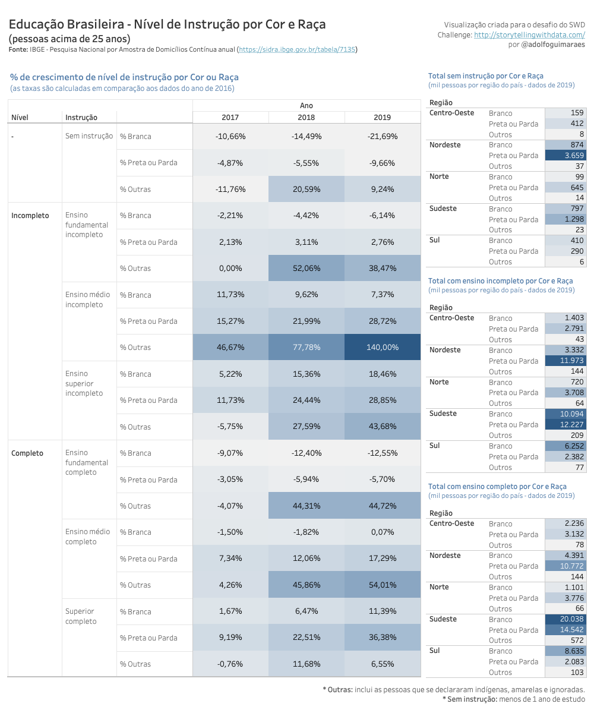

# SWD Challenge - Setembro 

A visualização a seguir foi criada para o desafio do **SWD Challenge de Setembro**. Como a publicação no site do desafio é feita em inglês, vou sempre gerar uma versão em português que será postada aqui no Github. O post original em inglês pode ser acessado a partir [deste link](https://community.storytellingwithdata.com/challenges/43b0afca-b6c3-4adf-97aa-4c115f61f432/0252fb77-3547-4c0c-b2a1-eb66acadd469).

O desafio do mês foi construir uma visualização em tabela. Eu usei um dataset que trás informações sobre o nível de educação de pessoas acima de 25 anos do Brasil. Os dados foram divulgados no site do **IBGE** a partir da *Pesquisa Nacional por Amostra de Domicílios Contínua Anual* que pode ser acessada por [este link](https://sidra.ibge.gov.br/tabela/7135). Minha proposta foi organizar essas informações por cor e raça, destacando o crescimento (ou redução) dos números nos últimos 4 anos. Quanto mais escuro a célula, maior o valor. Também coloquei na visualização os dados por região do Brasil. Dada a deferença socio-econômicas das regiões, achei interessante mostrar estas informações também. 

Vale ressaltar um ponto: no caso das informações sobre **Sem instrução** e **incompleto**, valores altos implicam, em uma análise inicial, dados não muitos bons. Já que o número de pessoas com pouca instrução vem aumentando. No entanto, números altos na categoria **completo** é um bom indicativo, já que mostra que o número de pessoas com formações completas vem aumentando. Claro que isso é uma análise inicial baseada somente neste números. Do ponto de vista da visualização, usei as mesmas cores, não fazendo diferença na exibição. Como a mesma cor, tem interpretações distintas, fiquei pensando se isso não atrapalharia a interpretação dos dados. É um ponto a se estudar mais :) 

Quem quiser comentar, só acessar o [instagram](https://www.instagram.com/p/CFkSII9BL24/?utm_source=ig_web_copy_link) que fiz uma postagem sobre isso e dar sua contribuição nos comentários :) 

Até o próximo desafio.